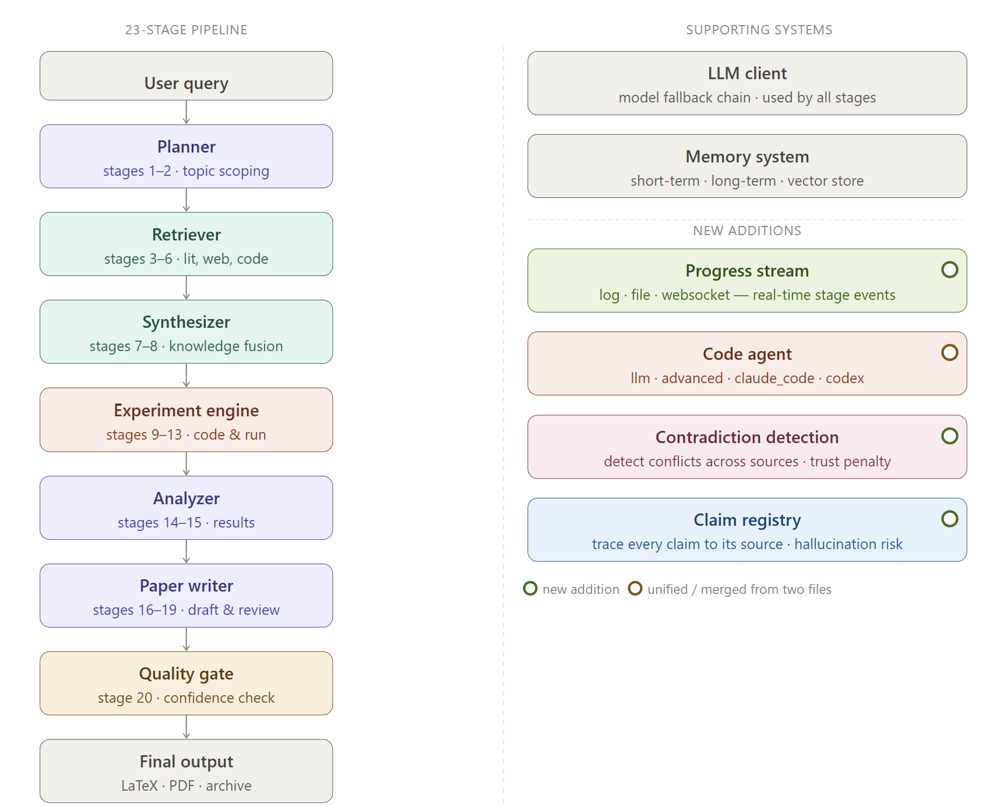

<p align="center">
  
</p>
<p align="center">
  <b>Type a research topic. Get a conference-ready paper.</b>
</p>
<p align="center">
  <a href="LICENSE"></a>
  <a href="https://python.org"></a>
  <a href="https://discord.gg/u4ksqW5P"></a>
</p>
---
AutoResearch - The Autonomous Research Pipeline
AutoResearch is an AI-powered tool that helps researchers generate high-quality academic papers. Simply input a research topic, and the system will automatically search for related papers, design experiments, and write a comprehensive academic paper complete with citations, figures, and LaTeX formatting.
```bash
auto-research run --topic "Attention mechanisms in protein folding" --auto-approve
```
---
Quick Start
1. Clone and Install
```bash
git clone https://github.com/aiming-lab/AutoResearch.git
cd AutoResearch
python3 -m venv .venv && source .venv/bin/activate
pip install -e .
```
2. Configure
```bash
cp config.example.yaml config.yaml
# Open config.yaml and set your API key and model
```
Or use the interactive setup:
```bash
auto-research setup   # checks Docker, LaTeX, and extras
auto-research init    # guided config wizard
```
3. Run
```bash
export OPENAI_API_KEY="sk-..."

auto-research run --topic "Your research idea" --auto-approve
```
The output will be saved in `artifacts/rc-YYYYMMDD-HHMMSS/deliverables/` — open `paper_draft.md` to read your paper, or upload `deliverables/` directly to Overleaf.
---
What You Get
File	What it is
`paper_draft.md`	Full paper — Introduction, Method, Experiments, Results, Conclusion
`paper.tex`	Conference-ready LaTeX (NeurIPS / ICLR / ICML templates)
`references.bib`	Real, verified citations — hallucinated references are automatically removed
`experiment runs/`	The Python code that was generated, run, and debugged
`charts/`	Auto-generated figures with error bars and confidence intervals
`reviews.md`	AI peer review with evidence-consistency checks
---
Modes of Operation
🤖 Fully Autonomous Mode
Walk away. The pipeline will handle everything, from literature search to final PDF.
```bash
auto-research run --topic "..." --auto-approve
```
🧑‍✈️ Co-Pilot Mode
The system runs autonomously but pauses at three key moments for your input: choosing hypotheses, reviewing the experiment design, and co-writing the paper.
```bash
auto-research run --topic "..." --mode co-pilot
```
Mode	Command	Best for
Full auto	`--auto-approve`	Fast first drafts
Gate only	`--mode gate-only`	Light oversight at 3 checkpoints
Co-pilot	`--mode co-pilot`	Hands-on collaboration
Step-by-step	`--mode step-by-step`	Learning the pipeline
→ Full guide: docs/co-pilot.md
---
How It Works
The pipeline runs 23 stages across 8 phases. Gates (⛔) pause for your approval — skip them all with `--auto-approve`.
```bash
Phase A  Scoping      1–2    Break the topic into research questions
Phase B  Literature   3–6    Find real papers from arXiv, Semantic Scholar, OpenAlex  ⛔
Phase C  Synthesis    7–8    Cluster findings, generate testable hypotheses
Phase D  Design       9–11   Plan the experiment, write hardware-aware Python code  ⛔
Phase E  Execution    12–13  Run code in sandbox, self-heal bugs, iterate up to 10×
Phase F  Analysis     14–15  Analyze results — then decide: proceed, refine, or pivot
Phase G  Writing      16–19  Outline → draft (5,000+ words) → peer review → revise
Phase H  Finalize     20–23  Quality gate, LaTeX export, verify every citation  ⛔
```
---
Key Features
Real citations, not hallucinations.  
Every reference is verified against arXiv, CrossRef, and Semantic Scholar through a 4-layer verification pipeline. Unverified references are automatically removed.
Self-healing experiments.  
If the generated code crashes, the AI will patch the code and rerun it — up to 10 times before it stops.
Anti-fabrication guard.  
Numbers in the paper must come from actual experiment results. Unverified figures are blocked before they reach the writing stage.
Contradiction detection.  
When two sources make opposing claims, the system flags them — so you know where the science is unsettled before committing to a position.
Self-learning across runs.  
Lessons from failures are captured and injected into future runs, improving the pipeline over time and avoiding repeated mistakes.
Runs anywhere.  
Works via CLI, OpenClaw, and ACP-compatible agents. Can be triggered from Discord, Telegram, or Slack.
---
Supported LLMs and Agents
Any OpenAI-compatible API works. Supported agents include:
```yaml
# config.yaml
llm:
  provider: "acp"
  acp:
    agent: "claude"   # claude | codex | gemini | gh | kimi | opencode
```
---
Ethics
AutoResearch produces drafts. Before submitting anywhere:
Verify all claims, numbers, and citations yourself
Disclose AI assistance to the venue — most conferences now require this
Do not use this tool to generate fraudulent submissions
